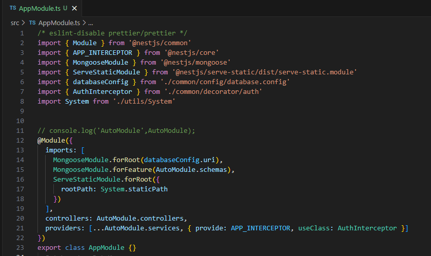

# nestjs-fast-demo

A template for NestJS 10.x,automatically import services and controllers,fast and simple boilerplate.
 - 一个基于nestjs10.x的快速开发模板，自动导入服务和控制器，快速且简单。

## Project Structure - 项目结构

```
.
├── src
│   ├── common
│   ├── enum
│   ├── model
│   ├── utils
│   ├── modules
│   ├── AppModule.ts
│   ├── main.ts
```

## Features - 功能
 - Auto import services and controllers - 自动导入服务和控制器
 - Global exception interceptor - 全局异常拦截
 - Global response processing - 全局响应处理
 - Global prefix - 全局前缀
 - Static file server - 静态文件服务器
 - Validation pipe - 校验管道
 - Scurity @auth - 权限认证

## Only one module - 只有一个模块
 - Only one global module for unified management, no more fatigue from manually importing too many modules
 - 全局只有一个模块统一管理，不再因为模块太多导致疲倦


## Development Notes - 开发注意事项

1. All modules are automatically imported into the AppModule, and the controllers and services are automatically registered.
 - 所有模块都会自动导入到AppModule中，控制器和服务的自动注册。
2. Development must follow the naming convention of XXXController.ts, XXXService.ts, XXXSchema.ts, otherwise it cannot be automatically registered.
 - 开发必须遵守XXXController.ts、XXXService.ts、XXXSchema.ts的命名规范，否则无法自动注册。

## Usage - 使用

```
npm install
```

```
npm run start
```
